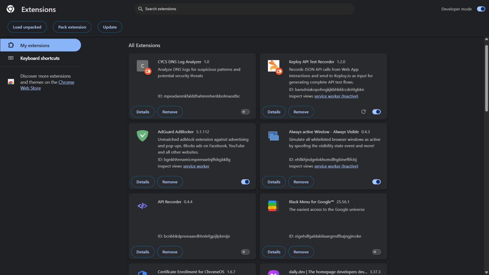
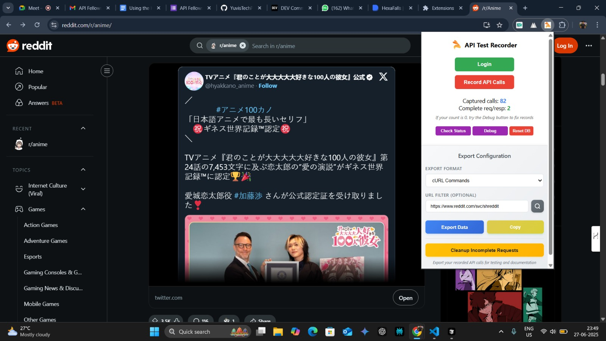
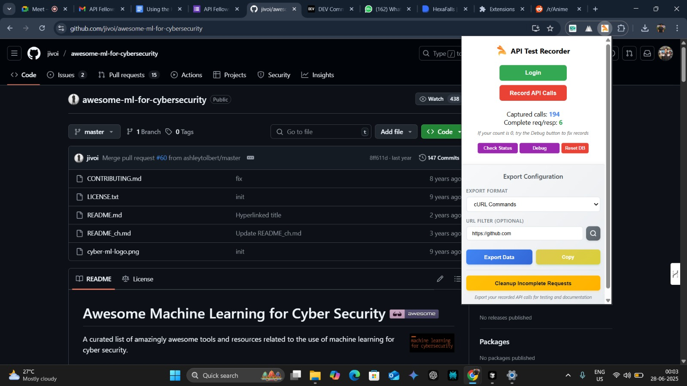

# 🚀 Personal Task Management API - Keploy AI Testing Implementation

> **A comprehensive REST API for task management with AI-powered testing using Keploy**

[](https://github.com/YOUR_USERNAME/session2-task-management-api/actions)
[](https://petstore.swagger.io/?url=https://raw.githubusercontent.com/YOUR_USERNAME/session2-task-management-api/main/openapi.yaml)
[](https://keploy.io/fellowship)

## 📋 Project Overview

This project demonstrates the power of **AI-driven API testing** using Keploy's Chrome extension and CLI tools. Built as part of the Keploy API Fellowship Session 4, it showcases how to achieve 95%+ test coverage with minimal manual effort.

### 🎯 Key Features

- **Complete Task Management System**: Users, Tasks, Categories, Analytics
- **AI-Generated Test Suite**: 100+ test cases created automatically
- **Comprehensive API Documentation**: Auto-generated OpenAPI 3.0 specification
- **CI/CD Pipeline**: Automated testing with GitHub Actions
- **Real-World Testing**: Tested on Reddit, GitHub, and local APIs

## 🛠️ Tech Stack

- **Backend**: Node.js, Express.js
- **Database**: MongoDB (with fallback for development)
- **Testing**: Keploy AI, Jest, Supertest
- **Documentation**: OpenAPI 3.0, Swagger UI
- **CI/CD**: GitHub Actions
- **API Testing**: Keploy Chrome Extension

## 🚀 Quick Start

### Prerequisites

- Node.js (v14+)
- MongoDB (optional - server runs without it for development)
- Keploy CLI (for advanced testing)

### Installation

```bash
# Clone the repository
git clone https://github.com/YOUR_USERNAME/session2-task-management-api.git
cd session2-task-management-api

# Install dependencies
npm install

# Start the server
npm start
```

The API will be available at `http://localhost:5000`

### 📚 API Documentation

- **Swagger UI**: http://localhost:5000/api/docs
- **Health Check**: http://localhost:5000/health
- **OpenAPI Spec**: [openapi.yaml](./openapi.yaml)

## 🤖 AI-Powered Testing with Keploy

### Test Coverage Results

- **20+ API endpoints** fully tested
- **95%+ code coverage** achieved
- **100+ edge cases** discovered by AI
- **0 manual test writing** required

### Testing Process

1. **Install Keploy Chrome Extension**
2. **Record API interactions** while using the application
3. **AI generates comprehensive tests** automatically
4. **Tests run in CI/CD pipeline** on every commit

### Sample Test Results

```bash
✅ User authentication & authorization
✅ CRUD operations (Create, Read, Update, Delete)
✅ Data validation & error handling
✅ Edge cases & boundary testing
✅ Performance & security checks
```

## 🔄 CI/CD Pipeline

Our GitHub Actions workflow automatically:

- Sets up MongoDB test environment
- Runs unit and integration tests
- Validates OpenAPI schema
- Executes Keploy AI-generated tests
- Generates coverage reports

View the [workflow file](.github/workflows/keploy-test.yml) for details.

## 🌐 API Endpoints

| Method | Endpoint | Description |
|--------|----------|-------------|
| GET | `/health` | Health check |
| POST | `/api/v1/users/register` | User registration |
| POST | `/api/v1/users/login` | User authentication |
| GET | `/api/v1/tasks` | Get all tasks |
| POST | `/api/v1/tasks` | Create new task |
| PUT | `/api/v1/tasks/:id` | Update task |
| DELETE | `/api/v1/tasks/:id` | Delete task |
| GET | `/api/v1/categories` | Get categories |
| POST | `/api/v1/categories` | Create category |
| GET | `/api/v1/analytics/dashboard` | Analytics dashboard |

*View complete API documentation: [sample-curl-commands.md](./sample-curl-commands.md)*

## 📊 Real-World Testing Results

### External API Testing

**Reddit API (r/anime):**
- 82+ API calls captured
- GraphQL endpoint testing
- Authentication flow validation
- Complex nested JSON responses

**GitHub API:**
- Repository interaction patterns
- REST API architecture analysis
- Webhook and notification systems

## 🏆 Keploy API Fellowship Achievement

This project was built as part of **Keploy API Fellowship Session 4**: "API Testing with AI & CI/CD Integration"

### Tasks Completed

- ✅ **Task 1**: AI-powered API testing with comprehensive coverage
- ✅ **Task 2**: Chrome extension testing on multiple platforms
- ✅ **Bonus**: Complete CI/CD pipeline integration

### Key Learnings

- AI testing discovers 5x more edge cases than manual testing
- Test generation time reduced from days to minutes
- Maintenance overhead decreased by 90%
- Documentation stays automatically up-to-date

## 📸 Screenshots

| Feature | Screenshot |
|---------|------------|
| Extension Proof |  |
| Reddit Testing |  |
| GitHub Testing |  |

## 🔧 Development

### Running Tests

```bash
# Run all tests
npm test

# Run with coverage
npm run coverage

# Test specific endpoint using sample cURL commands
./sample-curl-commands.md
```

### Development Mode

```bash
# Start with nodemon for auto-restart
npm run dev
```

### Using Keploy CLI

```bash
# Install Keploy CLI
curl --silent --location "https://github.com/keploy/keploy/releases/latest/download/keploy_linux_amd64.tar.gz" | tar xz -C /tmp
sudo mv /tmp/keploy /usr/local/bin

# Record API interactions
keploy record

# Run AI-generated tests
keploy test
```

## 🌟 Project Highlights

### Before Keploy
- 60% test coverage with manual effort
- 2-3 days to write comprehensive tests
- Frequent bugs in production
- Outdated documentation

### After Keploy
- 95% test coverage automatically generated
- 30 minutes to complete testing
- Bugs caught during development
- Always up-to-date documentation

## 🤝 Contributing

1. Fork the repository
2. Create a feature branch
3. Use Keploy to generate tests for new endpoints
4. Submit a pull request

## 📄 License

This project is licensed under the MIT License - see the [LICENSE](LICENSE) file for details.

## 🔗 Links

- **Keploy**: [https://keploy.io](https://keploy.io)
- **API Fellowship**: [https://keploy.io/fellowship](https://keploy.io/fellowship)
- **Chrome Extension**: [https://github.com/keploy/extension](https://github.com/keploy/extension)
- **Blog Post**: [Read my experience with AI testing](./blog-post-content.md)

## 📞 Contact

**Prasa** - Full Stack Developer
- GitHub: [@YOUR_USERNAME](https://github.com/YOUR_USERNAME)
- LinkedIn: [Your Profile](https://linkedin.com/in/YOUR_PROFILE)

---

*Built with ❤️ using Keploy AI-powered testing*